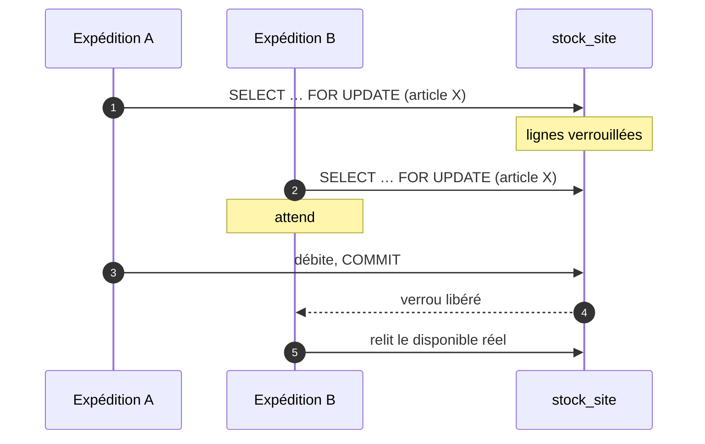
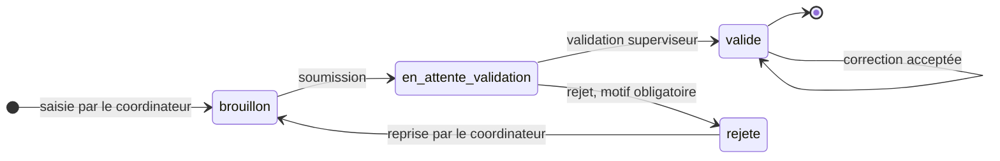
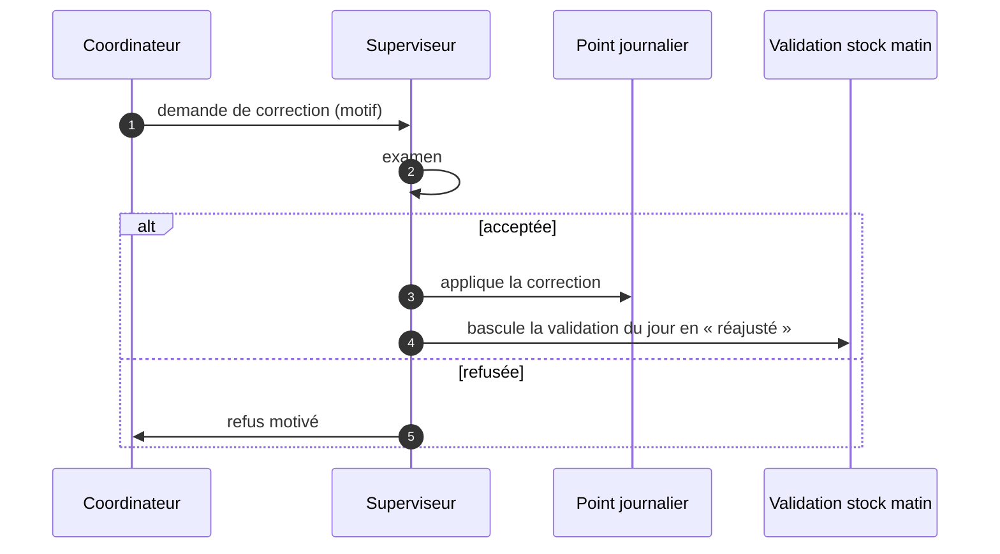
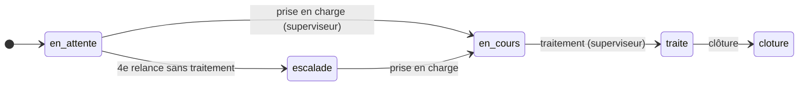
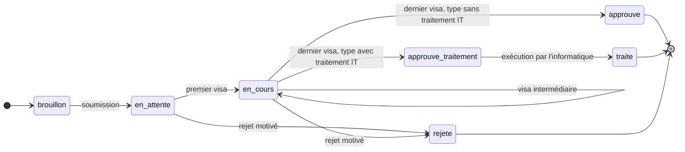
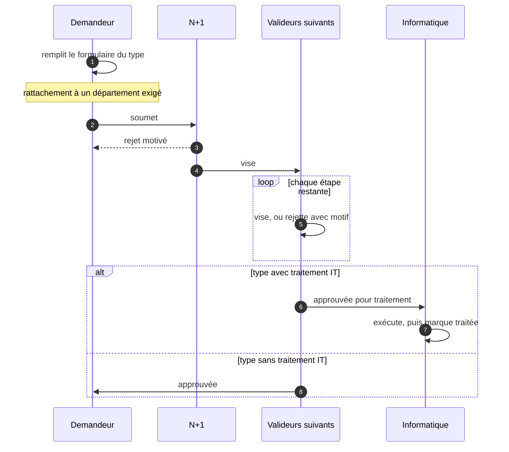
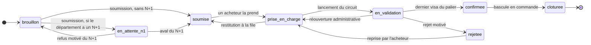
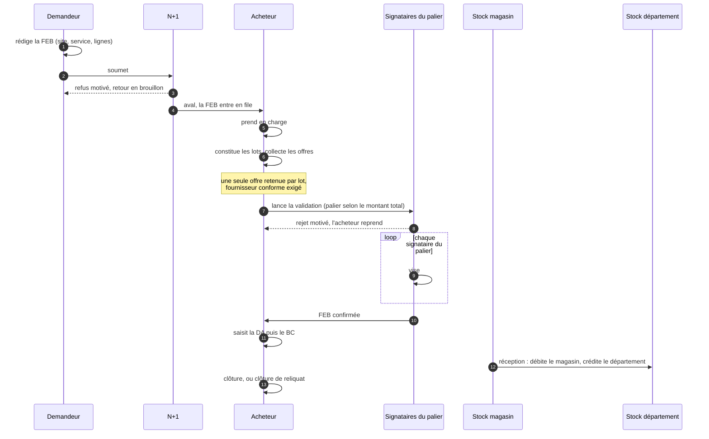

# Spécification fonctionnelle et technique — ERP EMUCI

**Dépôt de référence** : GayeGuy/ERP-EMUCI-V2
**Version du logiciel** : branche `main`, commit `59e3b0d` (24 septembre 2026)
**Version de la spécification** : 4.1
**Objet** : décrire ce que le système est, comment il est construit, les
règles qu'il applique et les limites qu'il porte.

> **Provenance.** Établie par lecture du code source et interrogation de la
> base. Chaque chiffre et chaque règle cités sont vérifiables à l'endroit
> indiqué.
>
> Ce document décrit le **comportement implémenté**, qui n'est pas
> nécessairement le comportement voulu. Là où le code signale lui-même une
> valeur provisoire, la spécification le répercute.
>
> **Note sur cette version.** La version 3.0 avait été établie depuis
> RUTHAXELLE/stockapp, qui avait divergé du dépôt de référence
> GayeGuy/ERP-EMUCI-V2 depuis fin août 2026. La quasi-totalité du contenu
> technique et des domaines Achats, Demandes internes et Inventaires restait
> exacte — ils sont partagés à l'identique entre les deux dépôts jusqu'à la
> séparation. Cette version 4.0 corrige le dépôt de référence, met à jour la
> volumétrie, et documente deux domaines propres à GayeGuy absents de la
> v3.0 : le tableau de bord KPI (§13.5) et l'outil de simulation & projection
> de stocks (§9.6), ainsi que le suivi des observations (§8.3) et la
> traçabilité des endommagements (§9.5).

---

## Sommaire

**Partie I — Technique**

1. [Objet et périmètre](#1-objet-et-périmètre)
2. [Architecture d'exécution](#2-architecture-dexécution)
3. [Modèle de données](#3-modèle-de-données)
4. [Transactions et concurrence](#4-transactions-et-concurrence)
5. [Sécurité](#5-sécurité)
6. [Exploitation](#6-exploitation)

**Partie II — Fonctionnel**

7. [Habilitations](#7-habilitations)
8. [Domaine Opérations](#8-domaine-opérations)
9. [Domaine Stock, bobines et inventaires](#9-domaine-stock-bobines-et-inventaires)
10. [Domaine Demandes internes](#10-domaine-demandes-internes)
11. [Domaine Achats](#11-domaine-achats)
12. [Domaine Informatique](#12-domaine-informatique)
13. [Services transverses](#13-services-transverses)
14. [Contraintes et points ouverts](#14-contraintes-et-points-ouverts)

---

# Partie I — Technique

## 1. Objet et périmètre

ERP EMUCI couvre la production de plaques d'immatriculation et la chaîne
logistique qui l'alimente, sur **vingt et un sites actifs**.

| Domaine | Objet |
|---|---|
| Opérations | Relevé quotidien de production, rapprochement avec la plateforme nationale, suivi des observations |
| Stock et bobines | Bobines de film, rivets, PMMA, consommables, équipements, traçabilité des endommagements |
| Inventaires | Comptages physiques et traitement des écarts |
| Demandes internes | Demandes administratives et circuits de visa |
| Achats | De l'expression de besoin à la réception, avec contrôle budgétaire |
| Informatique | Interventions de maintenance et affectation du matériel |
| Pilotage | Tableau de bord KPI et simulation de projection de stock |

**Hors périmètre** : la paie, la comptabilité générale — l'ERP produit une
imputation analytique, il ne tient pas les comptes — et la facturation
client.

---

## 2. Architecture d'exécution

### 2.1 Pile technique

| Élément | Choix | Précision |
|---|---|---|
| Runtime | PHP 8.2 | Image `php:8.2-cli`, serveur web intégré |
| Base | PostgreSQL 16 | Hébergée sur Neon — **environnement de recette** (voir 6.1) |
| Hébergement | Render | Conteneur bâti depuis le `Dockerfile` du dépôt |
| Accès données | PDO natif | Aucun ORM |
| PDF | Dompdf 3.1 | Fiches FEB, point journalier, rapports |
| Excel | PhpSpreadsheet 5.9 | Montée depuis 1.30.5 en septembre 2026, trois CVE de gravité haute (mémoire, SSRF) |
| PPTX | ZipArchive natif | Open XML écrit à la main, sans dépendance |
| Extensions PHP | pdo_pgsql, gd (freetype, jpeg) | gd requis par Dompdf |

Les deux seules dépendances applicatives du `composer.json` sont
PhpSpreadsheet et Dompdf. Elles sont auditées automatiquement à chaque envoi
sur `main` (voir 6.5).

### 2.2 Il n'y a pas de framework, et cela se paie

C'est le choix structurant. Quatre conséquences directes :

**1. Pas de routeur, donc pas de point de contrôle unique.** Chaque page est
un point d'entrée autonome qui pose lui-même sa barrière :

```php
require_auth();                              // session valide
require_permission('bobines', 'can_read');   // droit sur le module
```

Une page qui omet le second appel est ouverte à tout compte authentifié. Ce
n'est pas théorique : deux campagnes de reprise ont été nécessaires,
`43b1d1e` sur dix-sept pages puis `ed37027` sur sept de plus, dont certaines
ignoraient jusque-là totalement la table des permissions.

**2. Pas d'ORM.** Les requêtes sont écrites à la main, via douze fonctions
utilitaires dans `includes/db.php` (`db_query`, `db_fetch_all`,
`db_fetch_one`, `db_fetch_value`, `db_begin`, `db_commit`, `db_rollback`…).

**3. Pas de migrations versionnées.** Les évolutions de schéma sont des
fichiers dans `sql/` (78 fichiers), appliqués manuellement. Un outil
d'inventaire détecte désormais leur état réel sur une base donnée (6.3), mais
rien ne garantit qu'un environnement les a toutes reçues, ni dans quel ordre.

**4. La logique métier vit dans `includes/`**, pas dans des modèles.

| Module | Domaine |
|---|---|
| `achats.php` | Circuit FEB : le plus volumineux, un tiers de la logique métier |
| `dashboard.php` | Tableau de bord opérationnel |
| `groupes_config.php` | Navigation, dix groupes de menu |
| `demandes.php` | Circuit des demandes internes |
| `pdf_achats.php` | Génération PDF du domaine Achats |
| `session.php` | Authentification, permissions, session |
| `demandes_champs.php` | Formulaires dynamiques des demandes |
| `auth.php` | Connexion, verrouillage, réinitialisation |
| `inventaire.php` | Provisionnement des sessions d'inventaire |
| `periode.php` | Granularité temporelle, partagée entre la vue exécutive et le tableau de bord KPI |
| `referentiels.php` | Capacités de conditionnement (bobines, PMMA) |
| `upload.php` | Téléversements contrôlés |

### 2.3 Connexion à la base

PDO est configuré en **exceptions** (`PDO::ERRMODE_EXCEPTION`) et en tableaux
associatifs (`PDO::FETCH_ASSOC`).

Une exception PDO non rattrapée produit donc une erreur fatale et une page
blanche. C'est ce qui s'est produit sur la vue exécutive quand un filtre par
site référençait une colonne inexistante : la page entière tombait.

**Corollaire de conception** : tout appel de données dans un contexte
composite — un tableau de bord fait de blocs — doit être enveloppé. Le
registre du tableau de bord le fait, et journalise l'échec plutôt que de le
laisser remonter. Le tableau de bord KPI applique le même principe : chaque
panneau (§13.5) calcule ses propres indicateurs indépendamment des six autres.

### 2.4 Contrat des échanges dynamiques

Toutes les réponses AJAX ont la même forme, produite par `json_response()` :

```json
{ "success": true, "message": "…", "data": { } }
```

`success` porte le résultat, `message` est destiné à l'affichage,
`data` transporte la charge utile. Une requête AJAX est reconnue par
`is_ajax()`, et les pages servent alors du JSON là où elles rendraient du
HTML.

**Conséquence sur le contrôle d'accès** : une barrière qui redirige convient
à une navigation, pas à une requête AJAX — le client recevrait du HTML là où
il attend du JSON. `require_auth()` traite les deux cas séparément.

### 2.5 Configuration

La configuration est portée par des constantes (`APP_URL`, `APP_NAME`,
`APP_TIMEZONE`, `APP_VERSION`, `DB_HOST`, `DB_NAME`, `DB_PASS`…), avec
`DATABASE_URL` pour la connexion hébergée.

---

## 3. Modèle de données

**114 tables.**

| Domaine | Tables (approx.) | Principales |
|---|---|---|
| Bobines et films | 19 | `op_bobines`, `mouvements_bobines`, `bilans_mensuels_bobines` |
| Achats | 17 | `feb`, `feb_lignes`, `feb_offres`, `feb_suivi`, `achat_paliers`, `familles_achat` |
| Demandes internes | 6 | `di_demandes`, `di_types`, `di_etapes`, `di_roles` |
| Opérations | 13 | `op_points_journaliers`, `op_stock_rivets`, `points_emuci`, `op_observations`, `op_observation_relances`, `op_endommagements` |
| Inventaires | 22 | Session, détail et écarts, pour chacun des quatre inventaires |
| Parc | 7 | `equipements`, `nomenclatures`, `interventions_maintenance` |
| Référentiel | 8 | `users`, `roles`, `permissions`, `sites`, `departements`, `agents` |
| Pilotage | 3 | `vues_enregistrees` (vues KPI), `preferences_utilisateur`, `defauts_affichage` |
| Autres | 19 | `articles`, `stock_site`, `stock_departement`, `notifications`, `audit_log` |

### 3.1 Indexation

Le dump principal et les migrations portent l'indexation courante des
colonnes de recherche et des clés étrangères ; les migrations du module
Achats en ont ajouté une quinzaine à elles seules.

### 3.2 Le circuit stocké sur la demande

Le circuit de validation ne se stocke pas en lignes : il vit sur la demande
elle-même, sérialisé en JSON. Trois colonnes, présentes à l'identique dans
les demandes internes, les FEB et les affectations d'équipement.

| Colonne | Contenu |
|---|---|
| `workflow_snapshot` | Le circuit **figé** au lancement de la validation |
| `signatures` | La liste des visas donnés, avec auteur, date et commentaire |
| `historique` | La trace des actions |

**C'est un choix délibéré, avec une raison précise** : une demande transporte
sa propre copie du circuit. Modifier un type de demande ne réécrit donc pas
l'histoire des demandes en cours. Le prix à payer est qu'on ne peut pas
interroger les visas en SQL aussi simplement qu'une table de jointure.

Le **type de colonne diffère selon le module** : voir 3.5.

### 3.3 Trois notions de stock, à ne pas confondre

C'est la source d'erreur la plus probable pour qui découvre le modèle.

| Notion | Table | Portée |
|---|---|---|
| Stock global d'un article | `articles.stock_global` | Aucune ventilation par site |
| Stock magasin | `stock_site`, sites de type `magasin` | Stock central, source des livraisons d'achats |
| Stock d'un département | `stock_departement` | Ce qu'un service détient après réception |

Une réception d'achat **débite le magasin et crédite le département**. Le
stock global des articles n'est pas ventilé : c'est pourquoi un filtre par
site ne change pas le compte des alertes de stock.

L'outil de simulation (§9.6) introduit une **quatrième notion, hors base** :
le stock **projeté**, un calcul en mémoire qui ne modifie jamais aucune des
trois tables ci-dessus.

### 3.4 Dictionnaire des tables centrales

Sept tables portent l'essentiel du produit. Leurs colonnes structurantes,
leurs clés et leurs contraintes.

#### `users` — comptes

| Colonne | Type | Note |
|---|---|---|
| `id` | integer | Clé primaire |
| `nom`, `prenom`, `email` | varchar | `email` sert d'identifiant de connexion |
| `password_hash` | varchar | bcrypt, coût 12 |
| `role_id` | integer | → `roles.id` |
| `site_id` | integer | Site de rattachement, verrouille le coordinateur |
| `actif` | smallint | Un compte désactivé n'est jamais supprimé |
| `must_change_password` | smallint | Bloque toute page tant qu'il vaut 1 |
| `reset_token`, `reset_token_expiry` | varchar, timestamp | Réinitialisation en libre-service |

#### `permissions` — habilitations

| Colonne | Type | Note |
|---|---|---|
| `role_id` | integer | → `roles.id` |
| `module` | varchar | Un des cinquante-six modules administrables |
| `can_create`, `can_read`, `can_update`, `can_delete`, `can_export` | smallint | 0 ou 1 |

**Unicité sur `(role_id, module)`** : un rôle a au plus une ligne par module.
C'est ce qui rend `ON CONFLICT` utilisable dans les migrations de droits.

#### `op_points_journaliers` — le relevé quotidien

| Colonne | Type | Note |
|---|---|---|
| `site_id` | integer | → `sites.id` |
| `date_point` | date | Avec `site_id` et `type_point`, identifie le relevé |
| `type_point`, `statut` | text | `brouillon`, `en_attente_validation`, `valide`, `rejete` |
| `nb_vp`, `nb_camion`, `nb_semi`, `nb_moto` | integer | Détail par catégorie |
| `total_engins`, `total_plaques` | integer | Agrégats saisis |
| `rivets_utilises`, `rivets_endommages` | integer | |
| `created_by`, `validated_by` | integer | → `users.id` |
| `motif_rejet` | text | Obligatoire au rejet |

#### `op_bobines` — bobines de film

| Colonne | Type | Note |
|---|---|---|
| `numero` | varchar | **Unique** |
| `type_code`, `serie` | varchar | |
| `type_vehicule_id` | integer | → `op_types_vehicule.id` |
| `films_total`, `films_utilises`, `films_endommages`, `films_restants` | integer | `films_restants` est stocké, pas calculé à la volée |
| `site_id` | integer | → `sites.id` |
| `statut` | text | `en_stock`, `en_cours`, `epuisee`, `retiree` |

#### `di_demandes` — demandes internes

| Colonne | Type | Note |
|---|---|---|
| `numero` | varchar | **Unique** |
| `type_code` | varchar | → `di_types.code` |
| `statut`, `etape_actuelle`, `etape_rejet` | varchar, integer | Position dans le circuit |
| `demandeur_id`, `n1_user_id`, `traite_par` | integer | → `users.id` |
| `site_id` | integer | → `sites.id` |
| `champs` | **text** | Les valeurs du formulaire, en JSON |
| `workflow_snapshot`, `signatures`, `historique` | **text** | Le circuit figé, les visas, la trace |
| `traite_it` | smallint | Exécution informatique effectuée |

#### `feb` — expression de besoin

| Colonne | Type | Note |
|---|---|---|
| `numero` | varchar | **Unique**, attribué par exercice |
| `exercice` | integer | |
| `demandeur_id`, `acheteur_id`, `n1_user_id` | integer | → `users.id` |
| `site_id`, `departement_id` | integer | Constants sur toute la FEB (RG-06) |
| `urgence` | smallint | 0 normale, 1 urgente, 2 critique |
| `statut` | varchar | Les huit statuts |
| `montant_total` | **bigint** | En XOF, entier — pas de flottant |
| `workflow_snapshot`, `signatures`, `historique` | **jsonb** | |

#### `feb_lignes` — lignes d'une FEB

| Colonne | Type | Note |
|---|---|---|
| `feb_id` | integer | → `feb.id` |
| `numero_ligne` | integer | |
| `designation` | varchar | |
| `article_id`, `famille_id`, `fournisseur_id`, `nomenclature_id` | integer | Références au référentiel |
| `type_achat` | varchar | → `achat_types.code` |
| `code_analytique` | varchar | Dérivé, jamais saisi (RG-05) |
| `lot` | varchar | Égal au code analytique (RG-08) |
| `montant_ttc` | **bigint** | En XOF |

### 3.5 Deux observations sur les types

**Les montants sont des entiers (`bigint`), jamais des flottants.** Un
montant en XOF n'a pas de sous-unité : le stocker en entier évite les erreurs
d'arrondi qu'un `float` introduirait sur les cumuls et les comparaisons de
paliers.

> **Incohérence entre deux modules.** `feb` et `equipement_affectations`
> stockent leurs circuits en **`jsonb`** ; `di_demandes`, plus ancien, les
> stocke en **`text`**. Même structure, deux types. Le module des demandes
> internes se prive donc des opérateurs JSON de PostgreSQL : on ne peut pas y
> interroger un visa directement en SQL, il faut décoder côté PHP.

---

## 4. Transactions et concurrence

### 4.1 Où les transactions sont posées

`db_begin()` / `db_commit()` / `db_rollback()` sont appelées dans une
trentaine de fichiers, principalement là où plusieurs tables changent
ensemble : création d'une FEB (en-tête, lignes, pièces jointes), saisie d'un
inventaire, mouvements de bobines, réceptions, validation du stock du matin.

Le motif est constant : une seule transaction, et `db_rollback()` sur
exception.

### 4.2 Verrouillage explicite

Le code pose plusieurs `SELECT … FOR UPDATE`. Le cas le plus significatif est
le débit du stock magasin lors d'une réception d'achat :



Sans ce verrou, deux expéditions simultanées du même article liraient le même
disponible et le débiteraient chacune de leur côté.

**Le second usage est la numérotation des documents.** Deux compteurs suivent
le même motif : `feb_compteurs` pour les expressions de besoin, par exercice,
et `commande_compteurs` pour les commandes, par jour.

```php
INSERT INTO commande_compteurs (jour, dernier_numero) VALUES (?, 0)
  ON CONFLICT (jour) DO NOTHING;
SELECT dernier_numero FROM commande_compteurs WHERE jour = ? FOR UPDATE;
UPDATE commande_compteurs SET dernier_numero = ? WHERE jour = ?;
```

> **Pourquoi ce compteur existe.** La numérotation des commandes se faisait
> auparavant par tirage aléatoire — `CMD-Ymd-` suivi de quatre chiffres tirés
> au hasard. Sur un index d'unicité, une collision fait échouer l'insertion
> avec une erreur PostgreSQL brute (23505), que l'utilisateur voit comme un
> plantage sans explication. Un compteur verrouillé ne collisionne pas.
>
> `ach_numero_commande()` respecte la transaction appelante : elle n'ouvre la
> sienne que si aucune n'est déjà en cours.

### 4.3 Courses évitées par la condition de mise à jour

Plusieurs transitions ne se contentent pas de vérifier avant d'écrire : elles
**portent la condition dans le `WHERE`**, ce qui rend la course impossible
plutôt que peu probable.

```sql
UPDATE feb SET acheteur_id = ?, statut = 'prise_en_charge'
 WHERE id = ? AND acheteur_id IS NULL AND statut = 'soumise'
```

Deux acheteurs cliquant en même temps : le second ne met à jour aucune ligne
et reçoit un échec, plutôt que d'écraser l'attribution du premier. Le même
motif protège la restitution (`AND acheteur_id = ?`), la reprise après rejet
et la réouverture administrative.

---

## 5. Sécurité

### 5.1 Authentification

| Élément | Mise en œuvre |
|---|---|
| Hachage | `password_hash()` en **bcrypt, coût 12** |
| Longueur minimale | 8 caractères |
| Changement imposé | `must_change_password` — bloque toute page tant qu'il n'est pas fait |
| Réinitialisation | Jeton en base avec date d'expiration (`reset_token`, `reset_token_expiry`) |
| Nettoyage | Les espaces de bord sont retirés à la saisie **et** à la connexion |
| Verrouillage | **Cinq échecs consécutifs → compte bloqué quinze minutes** |

Le nettoyage des espaces n'est pas cosmétique : un mot de passe collé depuis
un e-mail avec une espace de fin était enregistré tel quel puis refusé à la
connexion, ce qui bloquait le compte.

#### Verrouillage après échecs répétés

Deux colonnes sur `users` portent le mécanisme : `failed_login_attempts` et
`locked_until`.

| Événement | Effet |
|---|---|
| Échec de connexion sur un compte existant | Incrémente le compteur |
| Cinquième échec | `locked_until = NOW() + 15 minutes`, compteur remis à zéro, **entrée d'audit nominative** |
| Tentative pendant le verrou | Refus, avec le nombre de minutes restantes |
| Connexion réussie | Compteur et verrou effacés |
| Changement ou réinitialisation du mot de passe | Compteur et verrou effacés |

> **La dernière ligne n'est pas une commodité.** Sans elle, un administrateur
> qui réinitialise le mot de passe d'un compte verrouillé le laisserait bloqué
> jusqu'à l'expiration du verrou, malgré le nouveau mot de passe.

La durée retenue — quinze minutes — est celle du délai d'inactivité de
session, pour ne pas introduire une seconde convention de durée dans
l'application.

### 5.2 Session

| Paramètre | Valeur |
|---|---|
| `cookie_httponly` | `true` — le cookie est hors de portée du JavaScript |
| `cookie_samesite` | `Lax` |
| `cookie_secure` | Activé si la requête arrive en HTTPS, **`X-Forwarded-Proto` compris** |
| Inactivité | **900 secondes**, soit quinze minutes |

La déconnexion pour inactivité est un garde-fou serveur, tracé dans le
journal d'audit.

> **Le détail qui compte derrière un proxy.** Render termine le TLS à sa
> frontière et transmet en HTTP simple au conteneur : `$_SERVER['HTTPS']`
> n'est donc **jamais** posé en production. Un test limité à cette seule
> variable laissait le cookie de session sans attribut `Secure`, malgré un
> HTTPS réel de bout en bout côté navigateur. La détection s'appuie désormais
> aussi sur l'en-tête `X-Forwarded-Proto` posé par le proxy.

### 5.3 En-têtes de sécurité

Posés dans `includes/session.php`, chargé par la quasi-totalité des écrans,
avant toute sortie.

| En-tête | Valeur | Effet |
|---|---|---|
| `X-Content-Type-Options` | `nosniff` | Interdit au navigateur de deviner le type d'une réponse |
| `X-Frame-Options` | `SAMEORIGIN` | Empêche l'inclusion dans un cadre tiers |
| `Referrer-Policy` | `strict-origin-when-cross-origin` | Limite la fuite d'URL vers l'extérieur |
| `Strict-Transport-Security` | `max-age=31536000; includeSubDomains` | Posé **uniquement en HTTPS** |
| `X-Powered-By` | *retiré* | Ne publie plus la version de PHP |

`SAMEORIGIN` plutôt que `DENY` : l'écran de paramétrage des fournisseurs
prévisualise les pièces jointes dans un cadre de même origine, que `DENY`
casserait.

### 5.4 Injection SQL

**Aucune superglobale n'est interpolée dans une requête.** Vérifié par
balayage de tous les fichiers PHP du dépôt : zéro occurrence de `$_GET`,
`$_POST` ou `$_REQUEST` à l'intérieur d'une chaîne SQL.

Deux mécanismes coexistent :

| Mécanisme | Usage | Sûreté |
|---|---|---|
| Paramètres liés | Très largement majoritaire | Sûr par construction |
| Fragment `AND colonne = valeur` | Filtres de portée | **Sûr uniquement parce que la valeur est castée en entier** à la lecture |

> **Le point de fragilité est le second mécanisme.** Sa sûreté ne tient pas à
> la requête mais à un `(int)` posé plus haut, souvent dans un autre fichier.
> Le jour où un filtre portera une chaîne — un code de site, un statut — le
> motif se retournera silencieusement. L'aide partagée
> `dash_filtre_site()` montre la bonne façon de faire : elle renvoie un
> fragment **paramétré**, `AND colonne = ?`, avec sa valeur à part. Le
> tableau de bord KPI reprend le même motif (`pref_clause_in()`), pour les
> mêmes raisons.

### 5.5 Injection HTML

L'échappement passe par l'aide `h()`, appliquée à toute donnée rendue.

### 5.6 Téléversements

| Contrôle | Valeur |
|---|---|
| Taille maximale | 10 Mo |
| Types admis | `application/pdf`, `image/jpeg`, `image/png`, `image/webp` |
| Vérification | **`finfo` sur le contenu**, pas l'extension du nom |

Vérifier le type réel plutôt que l'extension est le bon choix : un `.pdf`
renommé ne passe pas.

### 5.7 Le contrôle doit être posé à chaque action, pas à l'écran

C'est la leçon structurante de l'audit de septembre 2026, et elle découle
directement de l'absence de routeur (2.2).

Un fichier de page porte souvent **plusieurs actions** : l'affichage, et une
série d'actions AJAX traitées en tête du même fichier. Une barrière posée une
fois en haut du fichier protège l'ouverture de l'écran — elle ne dit rien du
droit requis par chaque action.

Le motif défaillant :

```php
require_permission('affectations_it', 'can_read');   // barrière d'écran
…
if ($action === 'promouvoir') {                       // action de modification
    // … aucun contrôle ici : can_read suffisait
}
```

Cinq occurrences ont été corrigées, dont deux permettaient une élévation de
privilège réelle :

| Écran | Action | Droit exigé auparavant | Droit exigé désormais |
|---|---|---|---|
| `affectations_it.php` | `toggle`, `promouvoir` | `can_read` sur l'écran | `can_update` |
| `import_emuci.php` | Import OptoPlate, OptoTrace | `can_read` sur l'écran | `can_create` |
| `interventions.php` | `demande_coordinateur` | `can_read` sur l'écran | `can_create` |
| `reception_site.php` | `add_message` | `can_read` | `can_update` |
| `operations/point_pdf.php` | Consultation d'un brouillon | Tout coordinateur de site | **Son auteur seul** |

> **Le cas `affectations_it` mérite d'être compris.** Un compte
> `maintenance_info` disposait de `can_read` sur cet écran mais pas de
> `can_update`. L'action `promouvoir` ne vérifiant rien, il pouvait basculer
> un compte — le sien compris — vers le profil `support_it` et s'ouvrir de
> nouveaux modules. La faille n'était visible ni à l'écran ni dans la matrice
> des droits : seule la lecture du code la révélait.

**Règle à appliquer** : toute action qui écrit vérifie son propre droit, sur
la même ligne que le premier accès aux données qu'elle modifie.

### 5.8 Ce qui n'est pas en place

> **Aucune protection CSRF.** Aucun jeton anti-rejeu n'est émis ni vérifié.
> Le cookie de session étant en `SameSite=Lax`, les requêtes intersites en
> `POST` ne l'emportent pas, ce qui couvre le cas ordinaire. Mais la
> protection repose entièrement sur ce comportement du navigateur, et non sur
> une vérification applicative.

C'est la dette de sécurité la plus nette du produit.

---

## 6. Exploitation

### 6.1 Deux environnements, deux moteurs

> **Point de cadrage.** L'installation Render + Neon est l'**environnement de
> recette**, pas la production. La production visée est un serveur dédié,
> avec une base créée séparément par le gestionnaire de base de données.

| | Recette | Production (cible) |
|---|---|---|
| Branche | `main` | `vps-mysql` — présente sur le dépôt de référence GayeGuy/ERP-EMUCI-V2 |
| Serveur | Render, conteneur `php:8.2-cli` | VPS dédié, Apache + PHP 8.4 |
| Base | PostgreSQL 16 (Neon), `DATABASE_URL` | MySQL 8, `.env` local |
| Déploiement | Automatique à chaque envoi sur `main` | `deploy.sh`, idempotent, avec sauvegarde préalable |
| Dépendances | `composer install` à la construction de l'image | `vendor/` **commité dans la branche** — aucune installation sur le serveur |

**Conséquence sur l'écriture des requêtes.** Les deux branches portent le
même produit sur deux moteurs. `includes/db.php` diffère (`pdo_pgsql` contre
`pdo_mysql`), et toute requête employant une syntaxe propre à PostgreSQL —
`INTERVAL '15 minutes'`, `ON CONFLICT`, `::date` — doit être traduite lors du
report sur `vps-mysql`. Les migrations de droits existent donc en deux
versions, `ON CONFLICT DO UPDATE` d'un côté, `ON DUPLICATE KEY UPDATE` de
l'autre.

**La migration des données** de la recette vers la production est un travail
distinct du portage du code : un script dédié copie table par table, ignore
les tables absentes de la cible plutôt que d'échouer, isole les lignes
refusées par une contrainte, et réaligne les auto-incréments sur le dernier
identifiant migré.

### 6.2 Limites de téléversement du serveur

L'image PHP officielle n'embarque pas de `php.ini`. PHP retombe alors sur ses
valeurs compilées : **2 Mo par fichier, 8 Mo par requête**. Les exports
OptoPlate et OptoTrace les dépassent, et étaient **rejetés avant même
d'atteindre le code applicatif** (`UPLOAD_ERR_INI_SIZE`), sans message
exploitable.

Le `Dockerfile` pose désormais `upload_max_filesize = 50M`,
`post_max_size = 55M` et `memory_limit = 256M` — ce dernier parce que
PhpSpreadsheet charge le classeur entier en mémoire pour le lire.

Le contrôle applicatif de 10 Mo (5.6) reste la limite effective pour les
pièces jointes ; ces réglages ne font que laisser la requête arriver jusqu'à
lui.

### 6.3 Évolutions de schéma

Fichiers `sql/` (78 au total), appliqués à la main. Certains sont écrits en
syntaxe MySQL (accents graves, `AUTO_INCREMENT`, `ENGINE=`) et sont
intégralement rejetés par PostgreSQL. Leur contenu est couvert par le dump
PostgreSQL, mais leur présence peut induire en erreur.

**Un outil d'inventaire** (`tools/inventaire_migrations.php`, ajouté le
11 septembre 2026) répond à un besoin précis : « pour chacune des
migrations, sait-on dire si elle a été appliquée ? ». Sans lui, l'état d'une
base ne se déduisait que par inspection manuelle de sa structure — et une
migration s'est révélée le 8 septembre 2026 n'avoir jamais été exécutée en
production (`commande_compteurs` absente), découverte par hasard.

Le script ne rejoue aucune migration : il extrait de chaque fichier les
objets structurels qu'il déclare créer (tables, colonnes, index,
contraintes) et vérifie leur présence réelle via `information_schema` /
`pg_indexes` sur la base ciblée. Une migration dont une partie seulement des
objets existe est classée **partielle** — le cas d'une migration interrompue
en cours de route.

> **Piège de vérification, rencontré deux fois.** `psql` préfixe ses erreurs
> SQL par le nom du fichier (`psql:/sql/x.sql:12: ERROR:`) et ses propres
> erreurs — dont « fichier introuvable » — par `psql: error:` en minuscules.
> Un compteur ancré sur `^ERROR` ou sensible à la casse annonce « zéro
> erreur » alors que rien n'est passé. Le script de chargement local cherche
> désormais `error` sans distinction de casse.

### 6.4 Journalisation

- **Audit métier** : table `audit_log`, alimentée par `audit_log()`.
- **Erreurs applicatives** : `error_log()`, visible dans les journaux du
  conteneur. Le registre du tableau de bord s'en sert pour signaler un bloc
  en échec sans casser la page.

### 6.5 Intégration continue de sécurité

Un workflow GitHub Actions (`.github/workflows/security-ci.yml`) s'exécute à
chaque envoi et à chaque demande de fusion sur `main` :

| Étape | Outil | Bloquant |
|---|---|---|
| Analyse statique | Semgrep, règles OWASP Top Ten + PHP | **Non** — le volume de signalements sur un dépôt existant n'a pas encore été trié |
| Vulnérabilités des dépendances | `composer audit` | **Oui** — peu de bruit attendu sur deux dépendances |
| Publication des résultats | SARIF vers l'onglet Security du dépôt | — |

Aucune étape de déploiement n'y figure : Render redéploie déjà
automatiquement depuis `main`. Un second déclencheur serait redondant, pas
une sécurité supplémentaire.

### 6.6 Environnement de développement

Docker Compose fournit PostgreSQL 16 et PHP 8.2, avec chargement automatique
du schéma. C'est ce qui permet de vérifier une page en l'exécutant plutôt
qu'en la relisant.

---

# Partie II — Fonctionnel

## 7. Habilitations

### 7.1 Le modèle

**Seize rôles**, **cinquante-sept identifiants de module**, **cinq droits**
par module : `can_read`, `can_create`, `can_update`, `can_delete`,
`can_export`.

La table `permissions` porte une ligne par couple (rôle, module).

| Catégorie | Nombre | Résolution |
|---|---|---|
| Exposés dans la matrice Admin → Permissions | 56 | Table `permissions`, administrables depuis l'interface |
| Hors table par conception | 1 | `inventaire_sessions`, par délégation nominative (7.3) |

**Aucun module contrôlé dans le code n'est absent de la matrice.** Ce n'était
pas le cas sur RUTHAXELLE/stockapp à fin août 2026 — les quatre modules
Achats (`achats`, `achats_dashboard`, `achats_param`, `achats_suivi`) y
protégeaient des écrans sans figurer dans le tableau `$modules` de
`pages/admin/permissions.php`, obligeant à passer par une migration SQL pour
ajuster leurs droits. Sur le dépôt de référence, ils sont administrables
depuis l'interface comme tous les autres.

L'inverse n'existe pas : aucun module affiché dans la matrice n'est inutilisé
dans le code.

#### Le piège de la liste recopiée

L'écran de permissions construit ses lignes depuis un tableau PHP, mais
envoyait autrefois au serveur une **liste de modules recopiée à la main en
JavaScript**. Les deux listes ont divergé : les modules ajoutés côté PHP
n'étaient pas inclus dans les données transmises, donc **remis silencieusement
à zéro à chaque enregistrement**. Les droits d'inventaire en ont fait les
frais.

La liste JavaScript est désormais dérivée du même tableau PHP
(`json_encode(array_keys($modules))`) : une case rendue à l'écran est
nécessairement sauvegardée.

### 7.2 La règle de repli, et son périmètre exact

> Un rôle dont **aucune** permission n'est renseignée voit **tous les blocs du
> tableau de bord**. Ce repli ne s'applique qu'au tableau de bord.

La distinction est essentielle et a longtemps été énoncée trop largement.

| Mécanisme | Rôle sans aucune permission | Rôle avec permissions, module absent |
|---|---|---|
| Accès à une page (`require_permission`) | **Refusé** — 403 | **Refusé** — 403 |
| Bloc du tableau de bord (`dash_bloc_visible`) | **Affiché** — repli | Masqué |

`_check_permission_db()` interroge la table et renvoie faux si aucune ligne
n'existe : il n'y a **aucun repli sur l'accès aux pages**. Le repli est porté
par `dash_role_a_des_permissions()`, consultée uniquement par la visibilité
des blocs. Le tableau de bord KPI (8.4) n'entre pas dans ce mécanisme : il a
sa propre ligne de permission (`kpi_dashboard`, `can_read`), sans repli.

**Conséquence pratique** : un rôle non paramétré n'a accès à rien, mais son
tableau de bord paraît complet. L'écart entre les deux impressions est un
piège de diagnostic — c'est la page qui dit la vérité, pas l'accueil.

**Conséquence de sécurité** : livrer un écran sans livrer sa ligne de
permission le rend invisible à tous sauf `admin` et `superadmin`, et aucune
erreur ne le signale. C'est arrivé sur six écrans en septembre 2026 (9.4).

### 7.3 Trois accès qui ne passent pas par la table

`can()` traite trois cas avant de consulter les permissions. Chacun répond à
un besoin que la matrice rôle × module ne sait pas exprimer.

**Les sessions d'inventaire sont nominatives.** Le module
`inventaire_sessions` **n'existe jamais dans la table `permissions`** :
l'accès est réservé à `admin`/`superadmin`, sauf délégation explicite à une
personne précise via la table `delegations`. Le code refuse délibérément de
retomber sur la table — s'il le faisait, l'ajout accidentel d'une ligne
donnerait un accès que personne n'a voulu, et masquerait le diagnostic.

**Le N+1 d'un gestionnaire de stock lit les commandes de son périmètre**,
même si son rôle ne porte pas le droit. La règle est ciblée sur la
**personne** réellement N+1 (`user_departements.is_n1`), pas sur un rôle :
accordé par rôle dans la matrice, l'accès s'étendrait à tous les porteurs de
ce rôle. La lecture seule est volontaire — le visa reste au superviseur
opération.

**Le gestionnaire opération est en lecture seule hors délégation.** Sur un
module qui lui est délégué, ses droits sont ceux de la table. Sur tout autre
module, **seul `can_read` peut passer** : les droits d'écriture sont refusés
sans consulter la table.

### 7.4 Portées implicites

Deux restrictions ne passent pas par la table des permissions :

- **`coordinateur_site`** est verrouillé sur son site. Le paramètre d'URL est
  ignoré pour lui — y compris sur le tableau de bord KPI, où sa sélection de
  sites est forcée plutôt que choisie.
- **`maintenance_info`** est restreint à la catégorie d'équipements
  `informatique`.

### 7.5 Les sous-rôles Support IT

Le rôle `support_it` n'ouvre **rien** par lui-même. Ses droits viennent des
sous-rôles actifs portés par `support_it_roles`, résolus à chaque requête par
`_support_it_can()`.

| Sous-rôle | Modules ouverts |
|---|---|
| `maintenance` | `interventions`, `equipements`, `sites` |
| `controleur_production` | `import_emuci`, `point_emuci`, `equipements`, `sites` |
| `gestionnaire_bobines` | `bobines`, `inventaire_bobines`, `equipements`, `sites` |

**Une exception, et elle est nécessaire.** Le module `demandes` est transverse
— il concerne tous les employés, quel que soit leur métier. S'il était filtré
par sous-rôle IT, aucun compte `support_it` n'y accéderait jamais, quoi que
porte la table `permissions`. Il est donc évalué directement sur
`permissions`, sans passer par la grille ci-dessus.

> **Le risque de bascule.** Un compte migré vers `support_it` sans qu'un
> sous-rôle soit activé dans le même mouvement perd tout accès, sans message
> explicite — l'inverse d'un compte resté sur son ancien rôle, qui
> fonctionne. La migration qui a fusionné `maintenance_info` dans `support_it`
> pose donc le sous-rôle **avant** de changer le rôle, pour qu'une
> interruption laisse le compte fonctionnel plutôt que muet.

### 7.6 Délégation

Un utilisateur peut déléguer ses visas à un autre pour une période donnée
(`delegations`). Sans cela, une demande reste bloquée à l'étape d'une
personne absente.

---

## 8. Domaine Opérations

### 8.1 Le point journalier

Entité centrale : `op_points_journaliers`. Un relevé porte un site, une date,
un type, et les quantités produites — véhicules par catégorie, plaques,
rivets utilisés et endommagés, heures de travail.

#### Cycle de vie



| Statut | Qui agit | Effet |
|---|---|---|
| `brouillon` | Coordinateur | Saisi, non transmis. **N'entre dans aucun agrégat.** |
| `en_attente_validation` | — | Transmis, attend le superviseur |
| `valide` | Superviseur | Compte dans tous les indicateurs |
| `rejete` | Superviseur | Refusé avec motif ; le coordinateur reprend |

> **Trois statuts, pas deux.** La distinction `brouillon` /
> `en_attente_validation` est structurante : un brouillon n'est visible que de
> son auteur, un point en attente est dans la file du superviseur. Les
> confondre fait chercher des points là où ils ne sont pas.

#### Correction d'un point validé

Un point `valide` n'est plus modifiable directement. La correction suit son
propre circuit :



**Effet de bord à connaître** : accepter une correction ne touche pas
seulement le point. La **validation du stock du matin** du même site et de la
même date passe au statut `reajuste`. Les deux domaines sont liés, parce
qu'un chiffre de production corrigé invalide le rapprochement de stock qui en
découlait.

### 8.2 Rapprochement EMUCI

**Import** (`import_optoplate`, `import_optotrace`, `import_sessions_emuci`) :
chargement du fichier de la plateforme nationale, donnant le nombre de
plaques par site et par `statut_plaque` (`in_use`, `declared_broken`, …).

Le fichier est refusé si des colonnes attendues manquent, avec la liste des
colonnes absentes.

**Point EMUCI** : compare le déclaré et le remonté, et expose les écarts.
Les sites présents dans le fichier mais inconnus de l'ERP sont isolés dans
`emuci_sites_inconnus` plutôt que rejetés.

### 8.3 Suivi des observations

Les observations sont saisies **dans** le point journalier (une liste de
lignes typées : info, alerte, relance, incident, urgence, autre) ; l'écran
`observations.php` porte leur **cycle de vie propre**, indépendant de celui
du point qui les a produites.



| Action | Acteur | Droit requis |
|---|---|---|
| Prendre en charge, traiter, clôturer | Superviseur | `can_update` sur `observations` |
| Relancer, confirmer la clôture | Coordinateur auteur | `can_read` suffit — ce sont des actions de son propre parcours |

**Règles :**

- Une observation ne peut être clôturée qu'après prise en charge — une
  observation `en_attente` refuse la clôture directe.
- La relance ne s'applique qu'à une observation `en_attente`, et respecte un
  délai minimal depuis la dernière relance (ou la saisie initiale).
- Au-delà de **trois relances**, l'observation bascule automatiquement au
  statut `escalade` — un statut filtrable, préféré à une notification qui se
  perdrait dans la liste.
- Un coordinateur n'agit que sur les observations de son propre site.
- L'historique n'est jamais supprimable.

L'écran expose un export Excel sur le même périmètre que les filtres
affichés.

---

## 9. Domaine Stock, bobines et inventaires

### 9.1 Cycle de vie d'une bobine

| Statut | Signification |
|---|---|
| `en_stock` | Reçue, non ouverte |
| `en_cours` | Ouverte, en consommation |
| `epuisee` | Films consommés |
| `retiree` | Sortie du circuit |

Une bobine porte `films_total`, `films_utilises`, `films_endommages`,
`films_restants`.

> **Seules les bobines `en_cours` comptent** dans les films restants affichés
> par les tableaux de bord.

### 9.2 Validation du stock du matin

Déclaration quotidienne par site (`validations_stock_matin`). Trois issues :
`valide`, `valide_avec_ecarts`, `valide_auto`. Le nombre d'écarts est stocké
(`nb_ecarts`) avec leur détail.

### 9.3 Rivets

`op_stock_rivets`, par site et par type. **Seuil d'alerte : 200 unités.** En
dessous, le site remonte dans les alertes.

### 9.4 Inventaires

Quatre natures de stock sont inventoriées — bobines, rivets, PMMA,
équipements — sur le même modèle en trois tables : l'inventaire
(`inventaires_*`), son détail ligne à ligne (`inventaire_details_*`), et les
écarts constatés (`ecarts_*`). Une quatrième table par nature
(`inventaire_corrections_*`) porte les demandes de correction.

#### La session, et ce qu'elle déclenche

La session (`inventaire_sessions`) est l'objet d'administration : elle porte
une périodicité, une date de début, et la liste des sites concernés
(`inventaire_session_sites`). Elle passe de `ouverte` à `cloturee`.

| Périodicité | Durée |
|---|---|
| `mensuel` | 1 mois |
| `trimestriel` | 3 mois |
| `semestriel` | 6 mois |
| `annuel` | 12 mois |

**La date de fin n'est jamais saisie** : elle est déduite de la périodicité
(`inv_date_fin()` — début + N mois − 1 jour). Le libellé l'est aussi quand
l'administrateur n'en fournit pas : « Inventaire mensuel — mars 2026 »,
« Inventaire trimestriel — T2 2026 ».

> **L'ouverture d'une session provisionne les inventaires.** Pour chaque site
> rattaché, l'application crée l'inventaire de chaque nature et **génère
> toutes ses lignes de détail** à partir du stock du moment. L'inventaire naît
> donc rempli du théorique, prêt à recevoir le physique.

#### Ce qui distingue les quatre natures

| Nature | Unité de comptage | Source du théorique | Particularité |
|---|---|---|---|
| Bobines | La bobine, objet individuel | `op_bobines.stock_systeme` | Seule nature à calculer aussi la consommation quotidienne moyenne sur 30 jours et l'écart entre saisie terrain et données EMUCI du jour |
| Rivets | Le **type** de rivet, quantité agrégée par site | `op_stock_rivets` | Le détail est clé sur `type_rivet`, pas sur un identifiant d'objet |
| PMMA | Le **type** de PMMA, quantité agrégée | `stock_pmma_site` | Le type est un texte libre : la liste dépend de ce qui existe en stock |
| Équipements | L'équipement, objet individuel | `equipements` actifs du site | **Pas de quantité** — c'est une checklist de présence : trouvé / manquant |

L'inventaire des équipements est le seul à ne figer aucun stock système : un
équipement est présent ou absent, il n'a pas de quantité à comparer.

#### L'écart déjà connu ne se recompte pas

Chaque ligne de détail porte `ecart_connu_avant` : la somme des écarts
**déjà ouverts** sur cet objet au moment où l'inventaire est créé.

C'est ce qui évite de compter deux fois le même manquant — une fois au
constat initial, une fois à l'inventaire suivant tant que le traitement n'est
pas terminé. Le compteur lit les écarts au statut `ouvert` uniquement.

#### Les refus, et pourquoi ils sont explicites

Deux cas refusent la création plutôt que de produire un inventaire vide ou
doublon :

- un inventaire de même nature existe déjà pour ce site, cette date et cette
  périodicité, sans être annulé ;
- le site n'a rien à compter — aucune bobine active, aucun stock de rivets ou
  de PMMA, aucun équipement affecté.

Le second cas mérite le message explicite qu'il reçoit : un inventaire vide
serait indiscernable d'un inventaire non saisi.

#### Cycles de vie

| Objet | États |
|---|---|
| Session | `ouverte` → `cloturee` (ou `annule`) |
| Inventaire | `brouillon` → `valide` (ou `annule`) |
| Écart | `ouvert` → `resolu` |
| Demande de correction | `en_attente` → `autorise` ou `refuse` → `traite` |

**La création d'un inventaire journalier par un coordinateur de site n'est
plus possible** : elle dépend désormais de la session ouverte par
l'administration.

#### Les six écrans ont failli être invisibles

Les écrans Inventaire et Écarts pour les équipements, le PMMA et les rivets
ont été livrés et déployés **sans les lignes de permission correspondantes**.
Conséquence de la règle 7.1 — module absent vaut refus — ils étaient
invisibles pour tous les rôles sauf `admin` et `superadmin`, sans qu'aucune
erreur ne le signale. Corrigé en septembre 2026.

### 9.5 Traçabilité des endommagements

Un film endommagé se déclare **film par film**, avec sa cause, depuis le
pop-up dédié du point journalier, et se stocke dans `op_endommagements` — une
ligne par film, et non un compteur agrégé : six films abîmés sur une même
bobine peuvent l'avoir été à six moments et pour six causes distinctes, ce
que seule une ligne par film restitue.

L'écran `tracabilite_endommagements.php` ne fait **que lire** cette table :
la saisie reste exclusivement dans le point journalier, pour garder un seul
chemin d'écriture. Le coordinateur de site n'y voit que son propre site ;
l'écran propose des filtres et un export sur le même périmètre.

### 9.6 Simulation & projection de stocks

`simulation_stocks.php` est un outil de **projection en lecture seule** : il
lit l'historique de consommation et ne modifie jamais un stock réel — c'est
la règle qui a guidé toute la conception de l'écran.

#### Deux cas d'usage, un mode explicite

| Mode | Question | Couverture |
|---|---|---|
| `stock` | Avec un nombre de bobines/vignettes donné, jusqu'à quand l'activité tient-elle ? | Stock actuel ou saisi, projeté dans le temps |
| `ouverture` | Un ou plusieurs nouveaux sites s'ouvrent : le stock actuel absorbe-t-il la charge ? Sinon, combien commander pour tenir jusqu'à une date ? | Charge additionnelle des nouveaux sites |
| `les_deux` | Les deux combinés | — |

Le mode est un choix explicite de l'utilisateur, jamais déduit du
remplissage des champs : mélanger les deux questions obligerait l'utilisateur
à deviner ce que l'écran calcule.

#### Calcul par format, pas par moyenne de parc

La projection de stock se fait **format par format** — chaque conditionnement
de bobine a sa propre contenance en films, administrée depuis les
référentiels (9.7 et §13.6). Multiplier un nombre de bobines par une moyenne
du parc entier produisait un stock projeté qui ne correspondait à rien de
réel ; la quantité de chaque format reste éditable, et l'agrégat est la somme
des lignes retenues.

**L'autonomie est calculée séparément pour les bobines et pour les
vignettes** : un chiffre unique mélangeant les deux masquerait l'échéance la
plus proche.

#### Scénario d'ouverture de site

Le périmètre matière (formats de bobines, types de PMMA) que consommeront les
nouveaux sites est choisi explicitement — par défaut, l'ensemble des formats
existants est retenu, pour reproduire le comportement qui prévalait avant que
ce choix existe. Sans consommation journalière estimée saisie pour le nouveau
site, la consommation moyenne d'un site existant est retenue par défaut :
un zéro par défaut rendrait l'ouverture faussement indolore dans la
simulation. La consommation de PMMA d'un nouveau site est projetée du même
principe.

#### État de la page

Tous les paramètres de simulation sont portés par les paramètres de l'URL :
la page est intégralement rejouable et partageable par lien, sans aucun état
à enregistrer côté serveur.

---

## 10. Domaine Demandes internes

### 10.1 Structure

Un **type** (`di_types`) porte une liste ordonnée d'**étapes**
(`di_etapes`), chacune désignant un code de rôle valideur. Neuf types sont
actifs.

Les champs de formulaire ne sont pas en base : ils sont déclarés dans
`includes/demandes_champs.php`, et un moteur de rendu générique les affiche.

### 10.2 Workflow d'une demande



**La bifurcation finale dépend du type, pas de la demande.** Six types sur
neuf portent le drapeau `traitement_it` :

| Traitement IT requis | Types |
|---|---|
| Oui | Création d'accès NSIIV, basculement d'accès, basculement de compte, transfert d'agent, création de site, changement de géolocalisation |
| Non | Autorisation d'absence, imputation courrier, demande exceptionnelle |

Pour les six premiers, **approuvé ne suffit pas** : la demande reste à faire
tant que l'informatique ne l'a pas marquée traitée (`traite_it`), avec
éventuellement un numéro de ticket GLPI.

#### Le déroulé, acteur par acteur



#### Garde-fous

| Garde | Effet si non satisfaite |
|---|---|
| Le demandeur est rattaché à un département | Soumission refusée, message explicite |
| L'utilisateur n'est pas le demandeur | Impossible de viser sa propre demande |
| La demande est en `en_attente` ou `en_cours` | Toute autre tentative de visa est rejetée |
| Un rejet porte un motif | Rejet refusé sans motif |

### 10.3 Résolution des valideurs

Implémentée dans `di_user_roles()` et `di_can_validate()`.

| Rôle ERP | Étapes visables |
|---|---|
| `raf` | `raf` |
| `daf` | `daf` |
| `support_it`, `superviseur_it`, `maintenance_info` | `it` |
| `directeur_general`, `lecteur` | `dg` |
| `admin`, `superadmin` | toutes |

**Trois règles complémentaires :**

1. **`n1` n'est pas un rôle** : c'est le responsable du département du
   demandeur, résolu dynamiquement.
2. **Une étape rattachée à un département** (`di_roles.departement_id`) peut
   être visée par n'importe quel membre de ce département. C'est ce qui fait
   vivre le visa « Administration », dont le rôle ERP a été supprimé.
3. **Personne ne vise sa propre demande**, administrateurs compris.

### 10.4 Prérequis de dépôt

Un utilisateur doit être **rattaché à un département** pour soumettre. Sans
rattachement, le N+1 est introuvable et la soumission est refusée avec un
message explicite. Les administrateurs sont exemptés.

---

## 11. Domaine Achats

Le domaine le plus riche en tables et en règles de gestion numérotées dans le
code, reprises ici.

### 11.1 Workflow d'une FEB

C'est le circuit le plus long du produit : **huit statuts**, quatre acteurs,
et trois portes de retour en arrière.



> **Le statut `en_attente_n1` conditionne tout le reste.** Sans l'aval du
> supérieur hiérarchique, le service achats ne voit même pas la demande. La
> personne est **figée** sur la fiche à la soumission (RG-11) : un changement
> de responsable en cours de circuit ne déplace pas une signature attendue.

#### Qui agit, et sur quoi

| Transition | Acteur | Garde |
|---|---|---|
| Soumission | Demandeur | Trois familles au maximum (RG-02) |
| Aval ou refus | N+1 figé sur la fiche | — |
| Prise en charge | Acheteur | `acheteur_id` vide **et** statut `soumise` |
| Restitution | Le même acheteur | Statut `prise_en_charge` |
| Réattribution | Responsable | Statut `prise_en_charge` |
| Lancement de la validation | Acheteur | Une offre retenue par lot, fournisseurs conformes, un palier couvre le montant |
| Visa | Signataires du palier | Ne pas être le demandeur |
| Reprise après rejet | Le même acheteur | Statut `rejetee` |
| Réouverture | Administrateur | Statut `en_validation` — annule les signatures, tracé |
| Bascule en commande | Acheteur | Statut `confirmee` |

#### Le déroulé complet



#### Les trois retours en arrière

Un circuit qui ne sait que remonter est un circuit qui bloque. Trois portes
de sortie existent, chacune avec sa condition :

| Porte | Depuis | Vers | Réservée à | Effet |
|---|---|---|---|---|
| Refus du N+1 | `en_attente_n1` | `brouillon` | Le N+1 figé | Le demandeur corrige et resoumet |
| Reprise après rejet | `rejetee` | `prise_en_charge` | L'acheteur en charge | Les signatures sont remises à zéro |
| Réouverture | `en_validation` | `prise_en_charge` | Administrateur seul | Annule les signatures, tracé explicitement |

La troisième est **la seule porte de sortie d'une FEB en cours de
validation** : offres et montants y sont verrouillés (RG-12).

### 11.2 Les huit statuts

| Statut | Signification |
|---|---|
| `brouillon` | En rédaction par le demandeur |
| `en_attente_n1` | Attend l'aval du supérieur hiérarchique |
| `soumise` | En file, aucun acheteur attribué |
| `prise_en_charge` | Un acheteur se l'est attribuée |
| `en_validation` | Dans le circuit de visas, montants verrouillés |
| `confirmee` | Validée, prête à commander |
| `cloturee` | Terminée |
| `rejetee` | Refusée à une étape, avec motif |

Trois niveaux d'urgence : normale, urgente, critique. Le numéro est attribué
automatiquement, par exercice.

### 11.3 Les règles de gestion

| Règle | Énoncé | Où |
|---|---|---|
| **RG-02** | Trois codes analytiques au maximum par FEB. En pratique, trois familles distinctes. | `feb_fiche.php` |
| **RG-05** | Le code analytique n'est jamais saisi à la main, toujours dérivé. | `achats.php` |
| **RG-06** | Le site et le service sont constants sur toute la FEB. | `achats.php` |
| **RG-08** | Un lot est identifié par son code analytique, sans second identifiant. | `achats.php` |
| **RG-09** | Une ligne peut être en dérogation : son fournisseur diffère de l'offre retenue du lot, et elle est exclue de la comparaison. | `achats.php` |
| **RG-10** | Le circuit de visa se calcule sur le **montant total de la FEB**, jamais par ligne ni par lot. | `achats.php` |
| **RG-11** | Le N+1 est résolu et **figé** sur la FEB (`n1_user_id`) : un changement de responsable en cours de circuit ne déplace pas une signature attendue. | `achats.php` |
| **RG-12** | Offres et montants sont verrouillés dès `en_validation`. Seul un administrateur peut rouvrir, ce qui annule les signatures et laisse une trace. | `achats.php` |
| **RG-13** | La grille des paliers actifs doit couvrir toute la plage de montants, **sans trou ni chevauchement**. Contrôlé à l'enregistrement et à la désactivation. | `param_paliers.php` |

### 11.4 Le code analytique

`SITE / DÉPARTEMENT / FAMILLE`, composé des trois codes, en majuscules et
sans espaces. Vide si l'un des trois manque.

Chaque famille porte un **compte comptable SYSCOHADA** : trente-cinq
familles installées, toutes rattachées à un compte (241 outillage, 2442
équipements, 604 consommables, 605 fournitures, 611 transport, 624
maintenance, 628 télécoms, …).

### 11.5 Circuit de visa par palier

Un palier associe une tranche de montant à des signataires.

| Montant (XOF) | Palier | Signataires |
|---|---|---|
| 0 à 500 000 | RAF seul | RAF |
| 500 001 à 5 000 000 | RAF + DAF | RAF, DAF |
| Au-delà de 5 000 000 | RAF + DAF + PDG | RAF, DAF, PDG |

> **Ces bornes sont provisoires.** La migration qui les installe les qualifie
> de « bornes de démarrage arbitraires, aucun seuil réel fourni ». Le
> mécanisme est en place ; les seuils ne sont pas arrêtés.

**Le visa du N+1 intervient avant la prise en charge par les achats** : sans
son aval, le service achats ne voit pas la demande (RG-11).

### 11.6 Conformité fournisseur

Un fournisseur n'est retenu que s'il porte **trois pièces** :

| Pièce | Champ |
|---|---|
| RCCM | `doc_rccm` |
| DFE / identification fiscale | `doc_dfe` |
| RIB / attestation bancaire | `doc_rib` |

Une pièce manquante bloque la retenue de l'offre.

### 11.7 Lots et comparatif d'offres

Une FEB se découpe en **lots**, un par code analytique (RG-08). Chaque lot
reçoit des offres (`feb_offres`), dont **une seule est retenue**.

**Contrôle bloquant** : un lot sans offre retenue empêche la poursuite. Sans
ce contrôle, un lot pouvait passer en validation avec des lignes à 0 XOF et
sans fournisseur.

Retenir une offre reporte le fournisseur sur les lignes du lot, **sauf les
lignes en dérogation** (RG-09).

### 11.8 Contrôle budgétaire

Une **ligne budgétaire** porte un code comptable, un exercice, une enveloppe
et un **comportement**. La situation d'une ligne distingue l'**engagé**, le
**réservé** et le **disponible**.

La validation d'un budget de département suit son propre circuit
(`budget_validations`) : soumission, validation ou rejet motivé, avec
réouverture administrative possible.

> **Aucune enveloppe n'est renseignée.** Les six lignes installées ont une
> enveloppe vide, donc aucun plafond n'est effectif, et le comportement est
> `alerte` — jamais bloquant.

### 11.9 Suivi et réception

Après confirmation, la FEB devient une commande suivie.

| Statut de suivi | Signification |
|---|---|
| `en_attente` | Pas encore commandé |
| `commande` | Bon de commande émis |
| `en_retard` | Délai dépassé |
| `livree` | Marchandise arrivée |
| `receptionnee` | Contrôlée et entrée en stock |

La réception **débite le stock magasin** et **crédite le stock du
département** demandeur. Le débit pose un verrou sur les lignes de stock :
deux expéditions simultanées du même article ne peuvent pas lire le même
disponible.

Un reliquat peut être clôturé explicitement.

### 11.10 File d'attente et ancienneté

Une FEB soumise attend en file. Un acheteur la **prend en charge**, peut la
**restituer**, ou un responsable peut la **réattribuer**.

**L'ancienneté est calculée en heures ouvrées** : une fiche déposée vendredi
soir n'est pas comptée en retard le lundi matin.

### 11.11 Affectation des équipements achetés

Un équipement réceptionné suit un circuit propre : proposition
d'affectation, visa, puis confirmation de réception par le destinataire. Les
équipements entre les deux sont « en transit ».

---

## 12. Domaine Informatique

### 12.1 Interventions

`interventions_maintenance` porte le technicien, le site, l'équipement, le
problème signalé, les travaux effectués, les pièces changées, la durée en
minutes et un rapport en pièce jointe.

| Statut après intervention | Signification |
|---|---|
| `en_attente` | Déclarée, non traitée |
| `en_cours` | Prise en charge |
| `partiel` | Traitée partiellement |
| `resolu` | Terminée |

### 12.2 Parc et fin de cycle

Un équipement porte un état (`neuf`, `bon`, `usage`, `reforme`), une date de
mise en service et une **date de fin de cycle**, dérivée de la durée de vie
portée par sa nomenclature.

**Seuil d'alerte : 30 jours**, appliqué sur le tableau de bord et sur
l'écran des équipements. L'écran des rapports propose en outre une vue à
90 jours.

### 12.3 Transfert d'équipement

Recherche par numéro de série, destination, motif obligatoire. Tracé dans
`mouvements_equipements`. Requiert le droit de **création** sur
`affectations` — la lecture ne suffit pas.

---

## 13. Services transverses

### 13.1 Notifications

Deux canaux distincts :

- **En application** : table `notifications`, cloche avec compteur de non-lus
  dans la barre du haut.
- **Par e-mail** : `mailer_send()`, avec configuration SMTP ou API Brevo
  éditable depuis l'administration.

### 13.2 Journal d'audit

`audit_log`, alimenté par `audit_log()`. Trace qui a fait quoi et quand. Un
compte désactivé n'est jamais supprimé, précisément pour que sa trace reste
exploitable.

### 13.3 Documents PDF

Dompdf. Trois documents pour les achats — fiche seule, fiche avec circuit de
validation, bon de commande — et l'impression du point journalier.

### 13.4 Authentification

- Mot de passe haché (`password_hash`).
- **Changement imposé** (`must_change_password`) après création de compte ou
  réinitialisation par un administrateur : toute page redirige vers l'écran
  de changement, et les requêtes AJAX sont refusées, tant qu'il n'est pas
  fait.
- Réinitialisation en libre-service par jeton envoyé par e-mail
  (`reset_token`, `reset_token_expiry`), qui lève la contrainte.
- Les mots de passe sont nettoyés de leurs espaces de bord à la saisie comme
  à la connexion, un collage depuis un e-mail en traînant souvent.

### 13.5 Tableau de bord KPI

`kpi_dashboard.php` est un tableau de bord distinct des deux existants —
`dashboard.php` (opérationnel, orienté action du jour) et `pdg_overview.php`
(vue exécutive, narrative) — offrant une lecture visuelle de **sept familles
d'indicateurs**, chacune en panneau autonome : chiffre de tête, détail,
courbe d'évolution.

| Famille | Contenu |
|---|---|
| Production | Plaques, engins et plaques par jour écoulé sur A, comparés à B ; bandeau « Aujourd'hui » à quatre échelles (jour/semaine/mois/année), calé sur la date du jour et comparé à la période précédente **à date égale** ; courbe d'évolution A contre B |
| Bobines | Actives, épuisées, retirées ; taux d'utilisation calculé sur le retiré (dotation − reliquat), pas sur un compteur alimenté par le seul point journalier ; détail par série — photo de l'instant |
| PMMA | Consommation sur A comparée à B, consommation par type sur A ; stock par type et alertes de seuil à ce jour |
| Rivets | Consommation sur A comparée à B ; stock global et sites sous seuil à ce jour |
| Commandes | Total, servies, en cours sur A ; taux de satisfaction et délai de B ; taux sur les six dernières périodes |
| Équipements | Disponibles (`ok`, `neuf`, `bon`, `usage`), hors service, en maintenance, affectés — photo de l'instant |
| Sites | Production par site sur A contre B et classement ; un site actif sur B seulement reste affiché |

#### Période analysée (A) et période de comparaison (B)

`periode_contexte()` fournit A (type et date choisis) ; `periode_comparaison()`
(`includes/periode.php`) en dérive B selon le paramètre `cmp` :

| `cmp` | Période B | Durée comparée |
|---|---|---|
| `precedente` (défaut) | La période juste avant A | **À date égale** si A est en cours : B est arrêtée au même rang (1ᵉʳ → 24 août contre 1ᵉʳ → 24 septembre) |
| `an_prec` | A décalée d'un an — même semaine ISO l'année précédente, semaine 52 si la 53ᵉ n'existe pas ; le 29 février retombe au 28 | Périodes entières |
| `choisie` | Libre, de même granularité : `jour_b`, `mois_b`, `annee_b` (en hebdomadaire, `jour_b` porte le lundi de la semaine) | Périodes entières |

Toute valeur de B invalide retombe sur la période précédente. En annuel,
`an_prec` se confond avec `precedente` et n'est pas proposé.

Les indicateurs sont calculés sur des **intervalles de dates**
(`date_point BETWEEN du AND au`, agrégats `FILTER`) et non plus par égalité
de format (`TO_CHAR(date_point, 'YYYY-MM') = ?`) : une période arrêtée à date
ou choisie librement ne s'exprime pas par une égalité de format.

**Durées inégales.** Quand A et B n'ont pas la même durée — février contre
mars, ou A en cours comparée entière — la tuile « plaques par jour » divise
chaque total par ses **jours réellement écoulés** et reste comparable. En
mensuel, l'axe de la courbe couvre le plus long des deux mois et chaque
courbe s'arrête à son dernier jour.

**Base de comptage commune.** Production, PMMA et rivets excluent tous les
points en brouillon. Jusqu'au 24 septembre 2026, PMMA et rivets les
incluaient : deux panneaux voisins ne comptaient pas sur la même base.

**Sélecteur.** `periode_selecteur_comparaison()` rend le type, A, le mode et,
en mode `choisie`, B. En hebdomadaire, une liste de semaines
(« S38 · 14/09 → 20/09 ») remplace le champ date : `type=week` n'existe ni
sous Firefox ni sous Safari. `periode_selecteur()`, utilisé par
`pdg_overview.php`, est inchangé.

> **Portage MySQL.** Les nouvelles requêtes emploient `FILTER (WHERE …)` et
> `::date`, propres à PostgreSQL. Leur report sur la branche `vps-mysql`
> demande une traduction (`SUM(CASE WHEN … THEN … END)`, `CAST(… AS DATE)`).

> **Le biais de comparaison de périodes inégales, corrigé.** Comparer un mois
> en cours (8 jours écoulés) à un mois précédent complet (31 jours) affichait
> une variation de -72,7 % (2 070 contre 7 590) purement mécanique, alors
> qu'à nombre de jours égal la production était stable (-0,5 %). La
> comparaison automatique compare désormais le cumul à date de A au cumul de
> la période précédente arrêté au même rang ; une période choisie par
> l'utilisateur est comparée entière, avec mention et moyenne par jour.

> **Le taux de disponibilité des équipements, corrigé.** Ne compter comme
> disponible que l'état `etat = 'ok'` affichait 0,0 % de disponibilité sur un
> parc pourtant actif, l'essentiel étant saisi en `neuf` ou `bon`. Les quatre
> états `ok`, `neuf`, `bon`, `usage` comptent désormais comme disponibles ; un
> état inconnu tombe dans « autre état » plutôt que dans « disponible », pour
> rester visible sans gonfler le taux.

**Périmètre et vues enregistrées.** Le filtre de sites accepte une sélection
multiple, une sélection vide valant « tout le périmètre » ; le coordinateur
de site reste verrouillé sur le sien. Un utilisateur peut enregistrer une
combinaison de filtres — périodes A et B comprises — comme **vue nommée**
(table `vues_enregistrees`),
personnelle ou partagée ; seul son propriétaire peut la supprimer, même
partagée. Le rafraîchissement au changement de filtre est animé, sans
rechargement de page — le même moteur que `pdg_overview.php`.

Protégé par le module `kpi_dashboard`, `can_read`.

### 13.6 Référentiels & capacités

`admin/referentiels_operations.php` administre les **capacités de
conditionnement** — films par bobine selon la série, unités par carton PMMA —
auparavant codées en dur (500 dans l'INSERT de création de bobine,
« WSL/TL = 2000 sinon 500 » recopié dans les deux imports, rien pour le
PMMA). Un changement de conditionnement fournisseur se fait désormais ici,
sans déploiement.

- Une capacité peut être posée pour une **série entière** de bobines en une
  saisie, ou ajustée par type individuel en complément — le conditionnement
  dépend de la série, pas de la version.
- Le **code** d'un type de PMMA n'est jamais modifiable depuis cet écran : il
  relie le catalogue à `stock_pmma_site` et à tout l'historique de
  consommation ; le renommer détacherait le stock existant.
- Une capacité nulle ou négative est refusée.
- Les types présents dans les stocks mais absents du catalogue de référence
  sont signalés explicitement, plutôt que de retomber silencieusement sur
  une capacité par défaut.
- L'écran administre aussi, par rôle, **l'écran d'ouverture par défaut du
  tableau de bord KPI** (13.5) — ce sur quoi un utilisateur tombe avant
  d'avoir touché le moindre filtre. Une valeur vide supprime la ligne plutôt
  que d'enregistrer une chaîne vide, pour distinguer « pas de défaut » de
  « défaut absent ».

Écran d'administration, et non de paramétrage d'exploitation courante : une
capacité fausse ne se voit pas à l'écran, elle se propage silencieusement à
toutes les projections (§9.6) et à tout stock créé ensuite.

Protégé par le module `referentiels_operations`, `can_read`.

---

## 14. Contraintes et points ouverts

### 14.1 Valeurs provisoires, signalées par le code lui-même

| Point | En place | Manquant | Risque |
|---|---|---|---|
| Paliers de validation | Trois paliers fonctionnels | Les seuils réels | Une FEB peut suivre un circuit qui ne correspond pas à la règle de l'entreprise |
| Enveloppes budgétaires | Six lignes, comportement `alerte` | Tous les montants | Aucun dépassement n'est détecté |
| Types d'achat | DAF, DAI, DAH | Le développé exact des sigles | Cosmétique |

### 14.2 Dettes structurelles

1. **Contrôle d'accès non centralisé.** Sans routeur, chaque page pose sa
   propre barrière, et l'oubli ne se voit pas. Deux campagnes de reprise en
   témoignent : `43b1d1e` a remplacé les contrôles en dur par
   `require_permission()` sur dix-sept pages, et `ed37027`, le 29 août, a
   réaligné sept pages de plus — certaines ignoraient jusque-là totalement la
   table des permissions.
2. **Repli des rôles sans permission** (7.2). Utile en transition, dangereux
   s'il s'installe.
3. **Fichiers SQL en syntaxe MySQL.** Certains fichiers de `sql/` ne sont pas
   applicables sur PostgreSQL. Leur contenu est couvert par le dump
   PostgreSQL, mais leur présence est trompeuse.
4. **Deux pages de profil** coexistent, `mon_profil.php` et `profil.php`, la
   seconde n'étant presque plus référencée.
5. **Aucune table de suivi des migrations appliquées.** Un outil de détection
   existe désormais (`tools/inventaire_migrations.php`, 6.3), mais il inspecte
   l'état d'une base à un instant donné : il ne remplace pas un
   enregistrement systématique de ce qui a été joué, ni quand.
6. **Deux moteurs à maintenir en parallèle.** PostgreSQL en recette, MySQL en
   production : chaque requête à syntaxe propriétaire existe en deux versions,
   et rien n'empêche mécaniquement les deux branches de diverger.

> **Résolu depuis la v3.0.** Le point « quatre modules Achats hors matrice »
> était vrai sur RUTHAXELLE/stockapp à fin août 2026 ; il ne l'est pas sur le
> dépôt de référence GayeGuy/ERP-EMUCI-V2, où ces quatre modules sont
> administrables depuis l'interface au même titre que les cinquante-deux
> autres (7.1).

### 14.3 Ce que cette spécification n'établit pas

- **Les volumes cibles et la performance attendue.** Aucun objectif chiffré
  n'est inscrit dans le code.
- **La politique de sauvegarde et de restauration.** Un protocole
  export/restauration a été rédigé et éprouvé hors de ce document ; il
  s'appliquera à la base de production lors de sa création.
- **Les exigences de conformité** applicables aux données personnelles des
  agents.
- **Le comportement voulu** là où il diffère du comportement implémenté.
  Cette spécification décrit le second.

---

## Suivi des versions

| Version | Date | Base logicielle | Modifications |
|---|---|---|---|
| 1.0 | 2026-08-29 | `5ecb558` | Première édition |
| 1.1 | 2026-08-29 | `5ecb558` | Workflows ajoutés ; deux statuts manquants corrigés (`en_attente_validation`, `en_attente_n1`) |
| 2.0 | 2026-08-30 | `5ecb558` | Partie technique réelle : exécution, transactions et concurrence, sécurité, exploitation |
| 2.1 | 2026-08-30 | `5ecb558` | Dictionnaire des tables centrales ; schémas en SVG plutôt qu'en mermaid sur la page publiée |
| 3.0 | 2026-09-21 | `437102d` (RUTHAXELLE/stockapp) | Remise à niveau sur 29 commits. **Corrigé** : Render/Neon est la recette et non la production (6.1) ; Dompdf n'est plus la seule dépendance (2.1) ; 106 tables ; compteurs de lignes du métier ; statuts d'inventaire et de session (9.4). **Ajouté** : verrouillage après cinq échecs (5.1), en-têtes de sécurité et cookie `Secure` derrière proxy (5.2, 5.3), contrôle d'accès à l'action et les cinq failles corrigées (5.7), numérotation atomique des documents (4.2), limites de téléversement du serveur (6.2), intégration continue de sécurité (6.5), sous-rôles Support IT et exception `demandes` (7.4), cinq modules hors matrice et piège de la liste recopiée (7.1), réécriture complète des inventaires (9.4) |
| 4.0 | 2026-09-24 | `6b268a6` (GayeGuy/ERP-EMUCI-V2) | **Corrigé le dépôt de référence** : la v3.0 avait été établie depuis RUTHAXELLE/stockapp, divergent depuis fin août 2026. **Ajouté** : suivi des observations (8.3), traçabilité des endommagements (9.5), simulation & projection de stocks (9.6), tableau de bord KPI (13.5), référentiels & capacités (13.6), outil d'inventaire des migrations (6.3). **Corrigé** : 114 tables (3), 57 identifiants de module dont 56 exposés dans la matrice — l'écart des quatre modules Achats hors matrice ne se vérifie pas sur ce dépôt (7.1, 14.2) |
| 4.1 | 2026-09-24 | `59e3b0d` (GayeGuy/ERP-EMUCI-V2) | Tableau de bord KPI : période de comparaison choisie par l'utilisateur — précédente, l'an dernier ou libre —, règle de durée, calcul par intervalles de dates, moyenne par jour, brouillons exclus de PMMA/rivets, sélecteur hebdomadaire en liste (13.5). **Corrigé** : deux renvois au tableau de bord KPI pointaient vers un §8.4 inexistant (13.5). |
